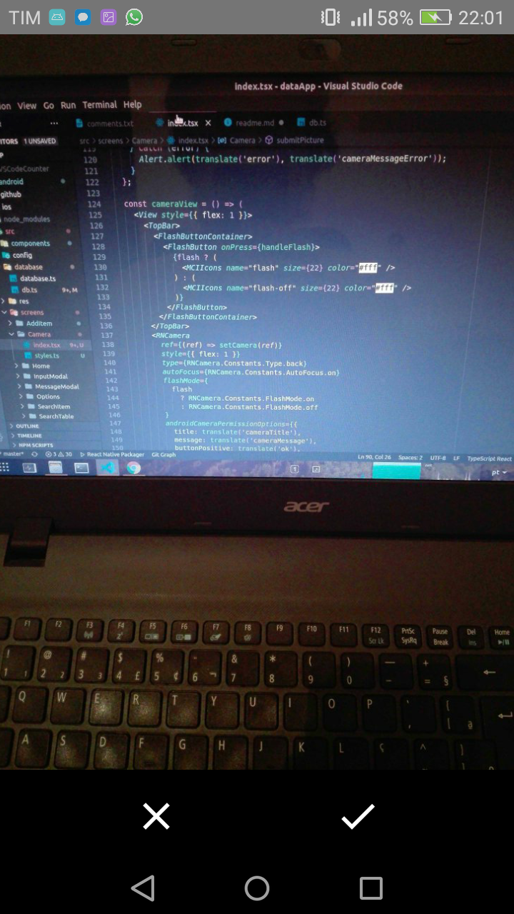

# Description

This application is a work in progress. The main objective is to create an App
to help garage shops catalog their tools. The concept revolves arround creating
virtual drawers where you place information and a picture about a tool for search in the future.

# Technologies

<ul>
  <li>Typescript</li>
  <li>React Native</li>
  <li>SQLite 3</li>
</ul>

# Screenshots

Disclaimer: Styles are not yet applied

Home screen where your drawers are listed.

  
  

Modal Screen to create a new drawer.

  

Screen to add a new item

  

Camera snapshot functionality

  

Preview snapshot screen

  

